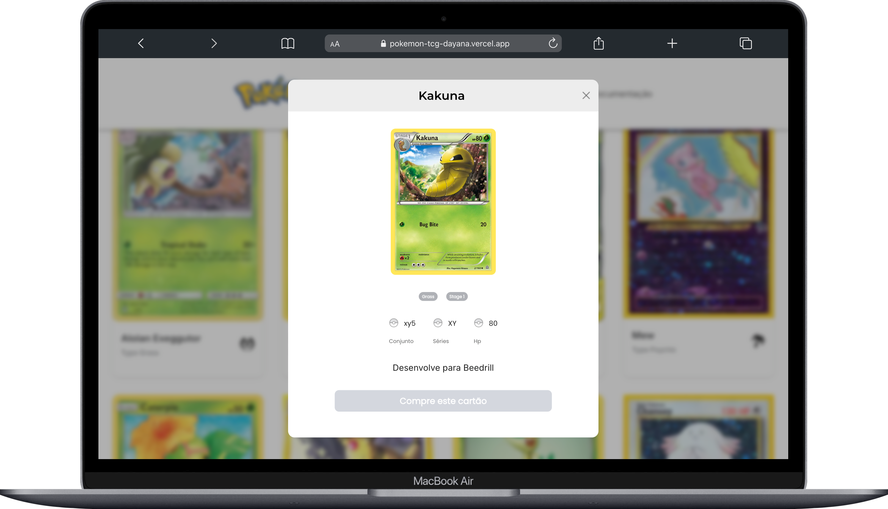
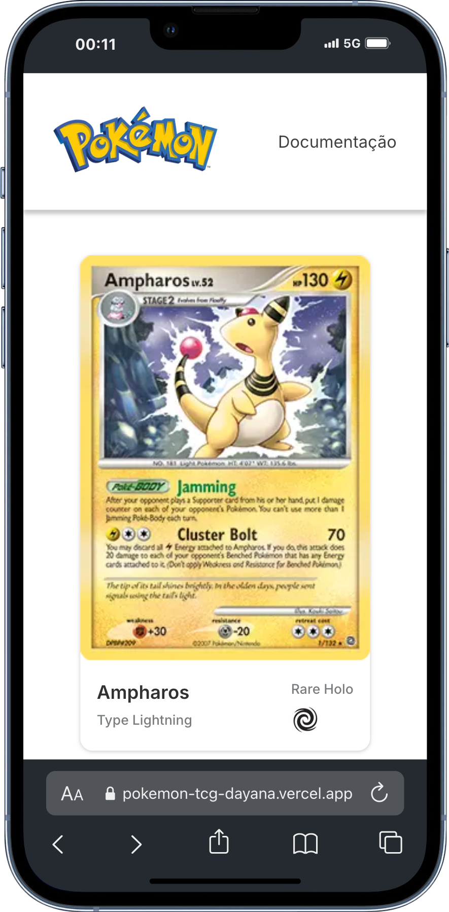

# Pokémom TCG - React
Repositório destinado a um projeto de página web Aplicação em React JS que consume a API de Pokémon TCG.
Nesse projetos pude praticar a criação de componentes, useEffect, UseState, consumo de API, CSS responsivo.

- Página inicial: lista de Pokémos
- Modal para mais informações de cada Pokémon
- Páginação

## Feito com
- HTML
- CSS
- JavaScript
- Fetch API
- React
- NextJs
- Vercel

### Deploy 
[Pokémon](https://pokemon-tcg-dayana.vercel.app/)
[Pokémon TCG API ](https://docs.pokemontcg.io/)

